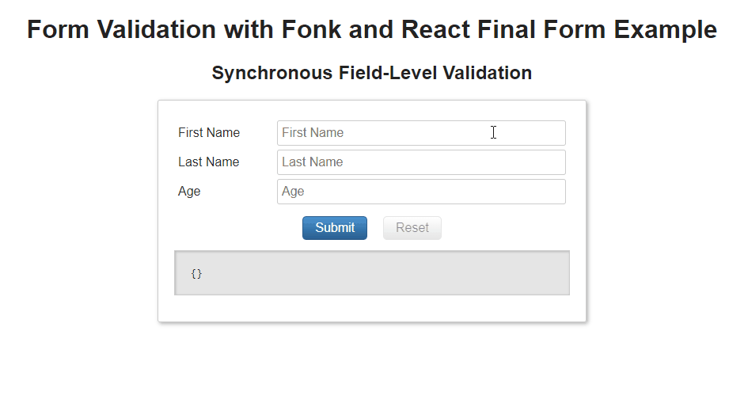

# Fonk

✅ Zero dependencies

✅ Plain vanilla js

✅ Framework Agnostic

✅ Seamless integration with [React Final Form](https://github.com/final-form/react-final-form#readme)

✅ Seamless integration with [Formik](https://github.com/formium/formik#readme)

✅ 💥 [**<4.5k gzipped**](https://bundlephobia.com/result?p=@lemoncode/fonk) 💥

Form schema validation library.

Fonk is a pure javascript, framework agnostic, form validation library.

It allows you to:

- Define validations that apply to your form in a declarative way.
- Isolate your form validation business logic from the ui.
- Unit test your form validation without having to mount the ui.
- Create reusable validation rules that can be easily unit tested.

[Live Demo (Fonk + React Final Form)](https://codesandbox.io/s/github/lemoncode/fonk/tree/master/examples/react-final-form/js/validate-field)

Fonk can be easily plugged into many libraries / frameworks or just be used in plain vanilla js.

Available integration examples:
  - Plain vanilla ES6.
  - React
  - [React Final form](https://github.com/Lemoncode/fonk-final-form).
  - [Formik](https://github.com/Lemoncode/fonk-formik).

Coming soon integration examples:
  - Vuejs.

How to [get started](https://lemoncode.github.io/fonk-doc/getting-started)

Check our [Fonk Documentation site](https://lemoncode.github.io/fonk-doc/).

# About Basefactor + Lemoncode

We are an innovating team of Javascript experts, passionate about turning your ideas into robust products.

[Basefactor, consultancy by Lemoncode](http://www.basefactor.com) provides consultancy and coaching services.

[Lemoncode](http://lemoncode.net/services/en/#en-home) provides training services.

For the LATAM/Spanish audience we are running an Online Front End Master degree, more info: http://lemoncode.net/master-frontend
